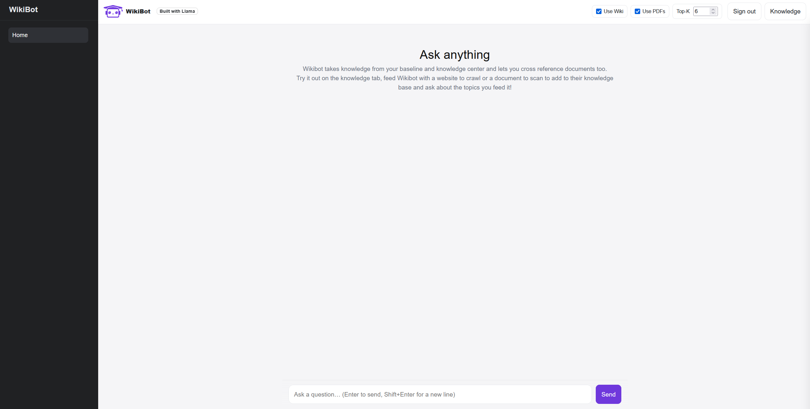
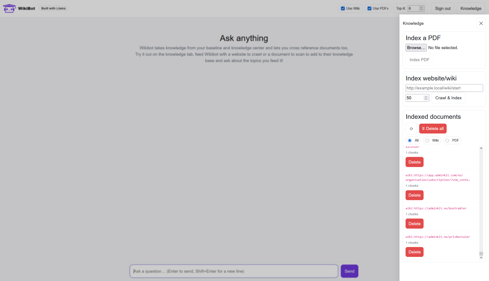
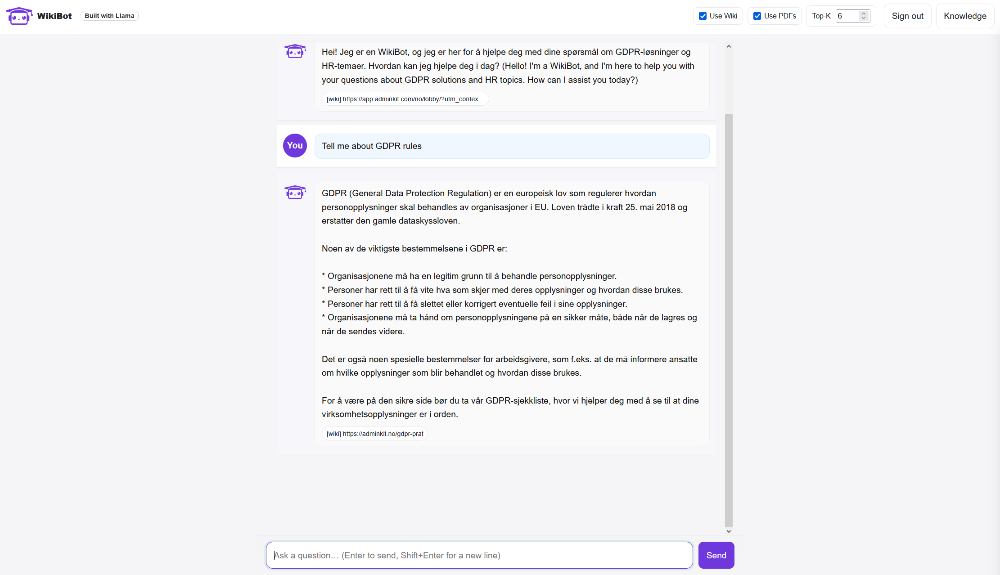
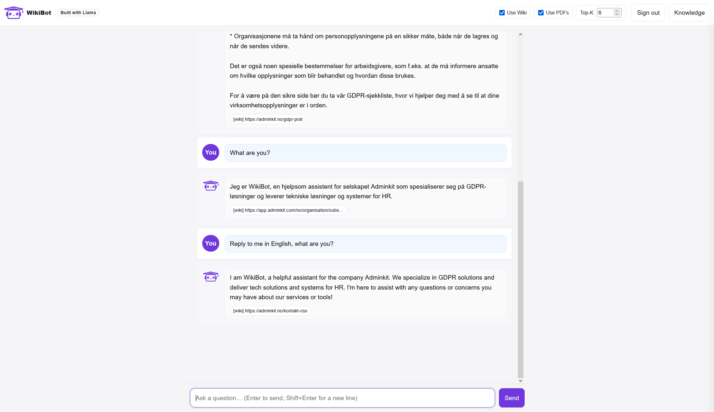

# WikiBot - Local Retrieval-Augmented Generation Chatbot (Blazor + Ollama + Qdrant)
**This is a showcase repo – it demonstrates the UI and overall architecture only.
Backend logic, authentication flow, and integration code are proprietary and not included here.**

A Windows based, local RAG chatbot built with .NET 9 and Blazor Web App.  
It crawls one or many wiki(s) (baseline knowledge) and indexes PDFs you upload, stores embeddings in Qdrant, and answers with a local Ollama model, wrapped in a ChatGPT style UI for ease of use.
Currently only immediately usable with Ollama, but is planned to have an universal thin LLM adapter added for LM Studio, llama.cpp server, vLLM, TGI, or even a tiny Python/ONNX service compatibility, thanks to Qdrant being pretty vendor agnostic.

> No Docker/VMs required. Use local HTTP endpoints for Ollama and Qdrant.

---

## Table of Contents

- [Showcase](#showcase)
- [Features](#features)
- [Stack](#stack)
- [Prerequisites](#prerequisites)
- [Getting Started](#getting-started)
- [Configuration](#configuration)
- [Auth Modes and RBAC](#auth-modes-and-rbac)
- [Runbook: Services](#runbook-services)
- [Project Structure](#project-structure)
- [API](#api)
- [UI Usage](#ui-usage)
- [Troubleshooting](#troubleshooting)
- [Licensing and copyright](#licensing-and-copyright)

---

## Showcase

You can run this project to get a feel for the UI, but the core functionality, APIs and LLMs are not included. This is exclusively a showcase of the actual repository. The real product is soft-wired to be a Norwegian speaking bot, but has bilinguality when prompted in case any English users want to use the bot, as shown below. Here are some image examples of the actual functionality and AI behavior when configured to be a helper and GDPR specialist for a local business, using their documentation to reason: 






---
## Features

- **ChatGPT style UI**
    - Sticky composer for better UX (Enter=send, Shift+Enter=newline)
    - Typing indicator and progress spinners
    - Right side **Knowledge** drawer (overlay)
    - **Citations**: Show only the sources used in the answer
    - Disclaimer: *Built with Llama* and AI-Act compliant disclaimer
- **Data sources**
    - **Website crawler** → baseline knowledge
    - **PDF parser** (PdfPig) → manual data input
- **RAG pipeline**
    - Word chunking with overlap
    - Token aware WordPiece chunking (optional, requires a vocab.txt)
    - Embeddings via **Ollama** (e.g. `nomic-embed-text`, `bge-m3`)
    - **Hybrid Retrieval**: BM25-lite, dense embeddings and reranker (cross encoder `bge-reranker-v2-m3`)
    - **Qdrant** vector search (payload: `docId`, `source`, `url`, `chunkId`, `text`, visibility/tenant)
- **Collection management**
    - **List docs** with chunk counts (filter by All / PDF / Wiki)
    - **Delete** by document Id
    - **Delete all** (filter by `pdf` / `wiki` / both)
- **Auth & RBAC**
    - **OIDC** with cookie auth and anti-forgery, token for state-changing requests (POST/PUT/DELETE)
    - **Roles**: `Admin`, `Indexer`, `Reader`
    - **DevBypass** mode for testing without an IdP
- **Reliability, GDPR and Ops**
    - **HTTP resilience** (retry/timeout/circuit-breaker) for Ollama/Qdrant
    - **Retention job:** daily purge of expired vectors (`expiresAt` payload)
    - Full control of data
    - Health probes: `/health/live`, `/health/ready`

---

## Stack

- **Frontend**: Blazor Web App (.NET 9, Server interactivity), custom CSS
- **Backend**: ASP.NET Core (controllers)
- **LLM**: [Ollama](https://ollama.com) local (e.g. `llama3`)
- **Embeddings**: Ollama (e.g. `nomic-embed-text`)
- **Vector DB**: [Qdrant](https://qdrant.tech) HTTP API (`http://localhost:6333`)
- **PDF**: `UglyToad.PdfPig`
- **Crawler**: `AngleSharp`
- **Auth**: Cookie, Jwt and OpenID Connect (OIDC)

---

## Prerequisites

- Windows 10/11
- **.NET 9 SDK**
- **Ollama** running locally  
  Pull the models you plan to use. For lower-end hardware:
  ```terminal
  ollama pull llama3
  ollama pull nomic-embed-text
  ```
  Use llama3.1, bge-m3 embed and bge-reranker-v2-m3 reranker for higher-end hardware:
  ```terminal
  ollama pull llama3.1
  ollama pull bge-m3
  ollama pull bge-reranker-v2-m3
  ```
- **Qdrant** running locally (default `http://localhost:6333`)  
  Use the single binary/service for Windows or run via WSL if preferred.
- (Optional) An OIDC provider (EntraId, Okta, Auth0, KeyCloak etc.) if using OIDC mode

---

## Getting Started

```terminal
# restore
dotnet restore

# run the app
dotnet run

# open the site
# https://localhost:{port-shown-in-console}/
```

> Ensure **Ollama** (`http://localhost:11434`) and **Qdrant** (`http://localhost:6333`) are up before starting.

---

## Configuration

`appsettings.json` (example):

```json
{
  "Logging": {
    "LogLevel": {
      "Default": "Information",
      "Microsoft.AspNetCore": "Warning",
      "Polly": "Warning",
      "Microsoft.Extensions.Http.Resilience": "Warning"
    }
  },
  "AllowedHosts": "*",
  "Retention": {
    "Enabled": true
  },
  "AppSettings": {
    "OllamaURI": "http://127.0.0.1:11434",
    "QdrantURI": "http://127.0.0.1:6333",
    "Client": "ollama", // what client to call
    "Embed": "nomic-embed-text", // what embed to use, e.g bge-m3
    "Model": "llama3", // LLM to use, e.g llama3.1
    "Collection": "kb", // note: If changing model/embed after using, rename to kb-{something else} or delete collection prior to doing so
    "ChunkSize": 800,
    "ChunkOverlap": 200,
    "RagTopK": 6,
    "EnableWiki": true,
    "EnablePdf": true,
    "WikiRoot": "https://example.local/wiki/start",
    "WikiMaxPages": 50,
    "UseTokenAwareChunking": true
  },
  "Auth": {
    "Mode": "DevBypass", // Set to "Oidc" for authentication and authorization usage
    "Authority": "http://localhost:8080/realms/wikibot", // Oidc authority, i.e login.microsoft.com/<tenant>
    "ClientId": "wikibot-ui", // Your client ID
    "ClientSecret": "dev-secret", // Client secret (Only for testing. This should instead be supplied through env variables)
    "RequireHttpsMetadata": false, // true for production
    "SingleOrgTenantId": "wikibot", // Tenant Id
    "RoleClaim": "roles" // Role claim identifier
  },
  "DevAuth": {
    "TenantId": "dev-tenant", 
    "UserId": "dev-user",
    "Roles": [ "Admin", "Indexer", "Reader" ]
  },
  "Scraper": {
    "TimeoutSeconds": 120,
    "UserAgent": "WikiBot/1.0 (+https://replace-this-with-your-intranet.local.url)",
    "Accept": "text/html,application/xhtml+xml",
    "AcceptLanguage": "nb-NO,nb;q=0.9,nn-NO;q=0.85,nn;q=0.8,no;q=0.7,en-US;q=0.5,en;q=0.4",
    "DefaultScheme": "https"
  },
  "Chunking": {
    "WordPieceVocabPath": "vocab.txt",
    "Lowercase": true,
    "OverlapTokens": 200,
    "MaxTokens": 800
  },
  "Hybrid": {
    "Enable": true,
    "LexicalTopN": 50,
    "Fusion": { "Alpha": 0.6, "Beta": 0.4, "PhraseBonus": 0.2 },
    "RouteBoostPdfHints": 0.15,
    "Reranker": {
      "Enable": true,
      "Model": "bge-reranker-v2-m3",
      "TopK": 12
    }
  }
}

```
Notes
- Switch between Auth.Mode = DevBypass (no IdP) and Oidc (Keycloak/Okta/EntraID).
- In prod, set RequireHttpsMetadata = true and supply secrets via environment variables or a secret store.
- Scraper.DefaultScheme lets you enter bare hosts like intranet.local and transforms to https://intranet.local.

---

## Auth Modes and RBAC

- **DevBypass with no IdP** - user is auto signed-in with roles from DevAuth.Roles. Useful for local dev.

- **Cookie auth and OpenID Connect** - Role claims are normalized (realm/client roles supported). Anti-forgery is enabled for safe logout.

**Roles**

- **Reader**: can chat/ask questions.
- **Indexer**: can crawl/index websites.
- **Admin**: can bulk-delete documents and manage everything.

**UI**

- Login/Logout buttons in the top-right (same style as “Knowledge” button).

**Keycloak quick setup (dev)**

1. Run and download [KeyCloak](https://www.keycloak.org/downloads)'s zip distribution
2. Start Keycloak in dev mode (`kc.bat start-dev`) and create/import a realm `wikibot` (using keycloakSetup.json).
3. Roles: `Admin`, `Indexer`, `Reader`.
4. Client `wikibot-ui` (confidential):
    - Redirect URI: `https://localhost:7107/signin-oidc`
    - Post-logout: `https://localhost:7107/`
    - Scopes: `openid profile email`
5. Users: assign appropriate roles.
6. In `appsettings.json`, set `Auth.Mode = "Oidc"` and point to the realm.

---

## Runbook: Services

**Ollama**
- Confirm it’s listening:
    - `GET http://localhost:11434/api/tags`
- This app uses:
    - Chat model: `AppSettings.Model` (e.g. `llama3`, `llama3.1` for more powerful hardware)
    - Embedding model: `AppSettings.Embed` (e.g. `nomic-embed-text`, `bge-m3` for more powerful hardware)
    - Reranker model: `Hybrid.Model` (e.g. `bge-reranker-v2-m3`)

**Qdrant**
- Confirm it’s up:
    - `GET http://localhost:6333/collections`
- Collection name: `AppSettings.Collection` (e.g., `kb`)  
  The app ensures/creates the collection automatically with the correct vector size.

**Retention**
- If `Retention.Enabled = true`, a background job calls `DeleteExpiredAsync` daily to purge expired vectors and/or recrawl wiki URLs.

**Health endpoints**
- `GET /health/live` - Checks if
- `GET /health/ready`

---

## Project Structure

```
WikiBot/
 ├─ Components/
 │  ├─ App.razor                         # Router
 │  ├─ Layout/
 │  │  ├─ MainLayout.razor               # Layout shell (sidebar + content)
 │  │  └─ NavMenu.razor                  # Sidebar
 │  └─ Pages/
 │     └─ Home.razor                     # Main chat and knowledge drawer
 ├─ Controllers/
 │  ├─ ChatController.cs                 # Index/search/delete/ask endpoints
 │  └─ AuthController.cs                 # Sign in/out endpoints
 ├─ Extensions/
 │  └─ AuthExtensions.cs                 # OIDC/DevBypass wiring and policies
 ├─ Helpers/
 │  └─ CollectionHelper.cs               # Qdrant collection dim parser
 ├─ Services/
 │  ├─ OllamaClient.cs                   # Chat and embeddings (Ollama REST)
 │  ├─ QdrantClient.cs                   # Index/Search/Delete/List/Retention
 │  ├─ PdfTextExtractor.cs               # PDF text (PdfPig)
 │  ├─ WikiScraper.cs                    # Crawler (AngleSharp)
 │  └─ Search/
 │     ├─ LexicalIndex.cs                # BM25-lite lexical index
 │     ├─ IReranker.cs                   # Reranker interface
 │     └─ Rerankers/                     # Cross-encoder reranker implementations
 │  └─ Security/
 │     ├─ DevBypassAuthHandler.cs        # Dev mode fake auth
 │     ├─ ForwardAuthCookiesHandler.cs   # For intra-app API calls
 │     ├─ RetentionService.cs            # Daily purge of expired vectors
 │     ├─ RoleClaimsTransformer.cs       # Normalizes role claims
 │     ├─ TenantResolver.cs              # Single-org tenant resolution
 │     └─ UserClaims.cs                  # Tenant/User helpers
 ├─ wwwroot/
 │  ├─ css/                              # App & component styles
 │  └─ js/chatKeys.js                    # UX Enter-to-send and focus functionality
 ├─ AppSettings.cs                       # Options model (Abstraction using IOptions pattern for config values)
 ├─ Program.cs                           # DI, Auth, routing, health
 ├─ keycloakSetup.json                   # Optional dev import
 └─ appsettings.json
```

---

## API

All routes are relative to the app (e.g., `https://localhost:xxxx`).

### Health / Sanity

`GET /api/chat/echo?q=hello`  
Returns `{ "answer": "..." }` from the LLM to verify Ollama connectivity.

### Indexing

**PDF**
```
POST /api/chat/index
Content-Type: multipart/form-data; name="file"
```
Response:
```json
{ "indexed": 42, "docId": "pdf:MyDoc.pdf:ABCD1234..." }
```

**Website baseline**
```
POST /api/chat/index-wiki?root=https://wiki.company.local/start&maxPages=50
```
If they are omitted, `root` / `maxPages` fallback to AppSettings.

### Listing / Deleting

**List docIds**
```
GET /api/chat/doc-ids?source=pdf|wiki   # source optional
```
Returns:
```json
[ { "docId": "wiki:https://...", "count": 37 } ]
```

**Delete by docId**
```
DELETE /api/chat/doc?docId=<docId>
```

**Delete all (filter-aware)**
```
DELETE /api/chat/docs              # delete both sources
DELETE /api/chat/docs?source=pdf   # delete only pdf
DELETE /api/chat/docs?source=wiki  # delete only wiki
```

### Ask (RAG)

```
GET /api/chat/ask?q=your+question&top=6&useWiki=true&usePdf=true
```
Returns:
```json
{
  "answer": "...",
  "ctxCount": 6,
  "sources": [
    { "source": "wiki", "url": "https://...", "preview": "..." },
    { "source": "pdf",  "url": "MyFile.pdf",  "preview": "..." }
  ]
}

```

### Authorization notes (default policies)
- `POST /api/chat/index-wiki` → requires Indexer (or Admin).
- `DELETE /api/chat/docs` (bulk delete) → requires Admin.
- Other endpoints require authentication, PDF uploads are private to the uploader by default.

---

## UI Usage

- **Knowledge button**:
    - **Index a PDF**: upload a file → *Indexes PDF*
    - **Index website**: set root URL and max pages to crawl → *Crawls & Indexes*
    - **Indexed documents**: filter (`All/PDF/Wiki`), **Refresh**, **Delete** row, or **Delete all** (respects the filter)
- Toggle **Wiki** / **PDF** and adjust **Top-K** from the header toolbar.

---


## Troubleshooting

- **302 (Found) on Ask**  
  You’re being redirected to sign-in. Log in first. In OIDC mode, API calls require auth.

- **`invalid_request` with scopes**  
  Ensure your IdP client allows `openid profile email` and the redirect URI matches exactly.

- **`RequireHttpsMetadata` error**  
  In dev, set `Auth.RequireHttpsMetadata = false`. In prod, use HTTPS and set it to `true`.

- **Embedding dimension is 0**  
  The embedding model didn’t return a vector. Make sure `nomic-embed-text` or another model is pulled and running in Ollama.

- **CreateCollection failed (VectorsConfig / 400)**  
  The client should auto-retry with legacy `vector_size`. If it still fails, check Qdrant version and logs.

- **Collection dimension mismatch**  
  If a collection exists with a different dim, either delete it manually or enable recreate (code should throw if this ever happens with a clear message).

- **“Enter to send” unreliable**  
  Ensure `/wwwroot/js/chatKeys.js` is updated and the module import path matches the app base path.

- **Crawler returns little text**  
  Some sites are sparse or script-heavy. Adjust `UserAgent/Accept/AcceptLanguage` in `Scraper` settings.

---

## Licensing and Copyright

This project is copyrighted by the original author (© 2025 Dennis Fjeldvang).  
The source code is made available here on GitHub **exclusively for portfolio purposes and personal use**.

- You are free to read and explore the code.
- You may run the project locally for learning or internal testing purposes and experimentation with RAG chatbots.

**Not permitted without the written consent of the author:**
- Commercial use (including sale, distribution, SaaS, or integration into your own products/services).
- Publication or redistribution of the project as a whole or in parts.

All commercial rights are reserved by the author or any legal successor (e.g., purchaser of the project or company).  
Violation of these terms is considered a copyright infringement under the Copyright Act and may be prosecuted.

For commercial inquiries, please contact the repository owner:
[LinkedIn](https://www.linkedin.com/in/dennis-fjeldvang-6a591620b/)
